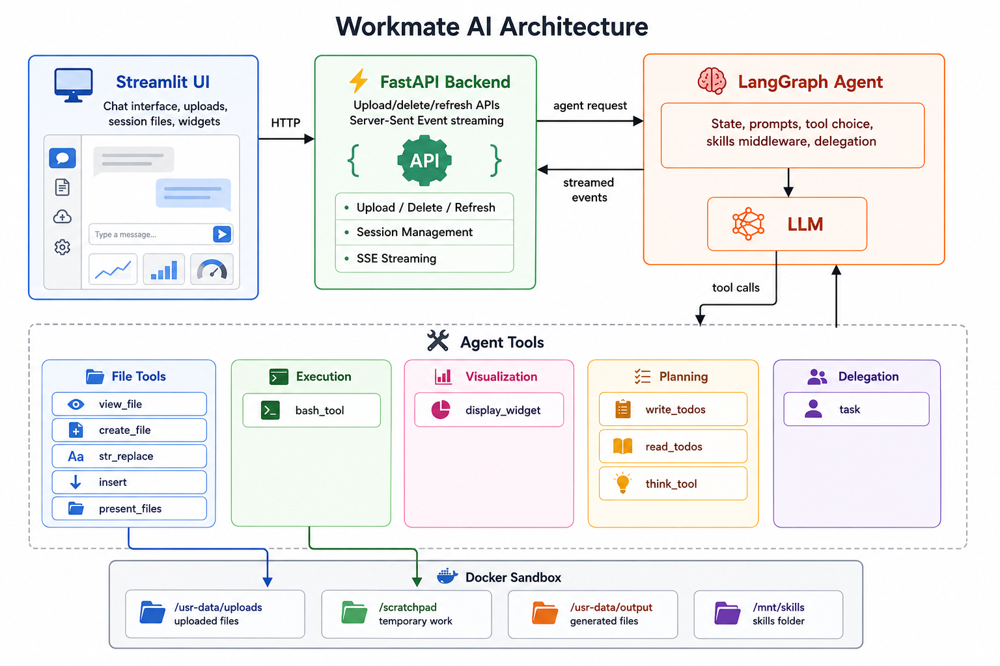

# Workmate AI

Workmate AI is a Claude-like agent runtime clone for working with files in a sandboxed environment. It combines a chat interface, a LangGraph agent, a Docker-backed filesystem, tool execution, skill discovery, and artifact delivery into one local developer project.

The project explores how modern file-working agents can upload documents, inspect or transform them, generate new artifacts, and render visual explanations while keeping execution isolated from the host machine.



## Core Capabilities

- Chat with an agent that can reason over uploaded files and generate new outputs.
- Execute bash commands and Python scripts inside a Docker sandbox.
- Work with plain-text files such as Markdown, CSV, JSON, HTML, YAML, Python, and logs.
- Process document and data formats such as PDF, DOCX, PPTX, XLSX, and images using container-installed libraries.
- Discover and use filesystem-based skills from `filesystem-env/skills`.
- Stream model output, tool calls, generated files, and widgets back to the frontend.
- Render self-contained HTML visualizations inside the chat UI.
- Delegate visualization work to a specialized sub-agent.
- Track multi-step work with built-in TODO tools.

## Architecture

Workmate has three main layers:

- **Frontend:** a Streamlit chat UI for file uploads, streaming responses, session files, and rendered widgets.
- **Backend:** a FastAPI service that handles uploads, session refreshes, file delivery, and Server-Sent Events.
- **Agent runtime:** a LangGraph/LangChain agent with tools for file operations, bash execution, skills, TODOs, sub-agent delegation, and HTML widget rendering.

The Docker sandbox provides the agent's working filesystem:

| Path | Purpose |
| --- | --- |
| `/usr-data/uploads` | Files uploaded by the user |
| `/scratchpad` | Temporary working directory for scripts and intermediate files |
| `/usr-data/output` | Final artifacts generated for the user |
| `/mnt/skills` | Mounted skills directory |

## Tech Stack

- **Python 3.12**
- **FastAPI**
- **Streamlit**
- **LangChain**
- **LangGraph**
- **Azure OpenAI**
- **Docker Compose**
- **uv**
- **LibreOffice and Python document/data libraries** inside the sandbox

## Project Structure

```text
.
|-- app/
|   |-- api/                 # FastAPI routes and controllers
|   |-- agent_registry/       # Agent, tools, prompts, middleware, sub-agents
|   `-- utils/                # Constants and logging
|-- filesystem-env/
|   |-- docker-compose.yml    # Sandbox service
|   |-- dockerfile            # Sandbox image
|   `-- skills/               # Bundled agent skills
|-- images/                   # README assets
|-- streamlit_app/
|   |-- app.py                # Streamlit entry point
|   |-- api_client.py         # API client
|   `-- components/           # UI components
|-- files/                    # Local session uploads/downloads
|-- main.py                   # FastAPI entry point
|-- pyproject.toml
|-- uv.lock
`-- README.md
```

## Setup

### Prerequisites

- Python 3.12+
- Docker Desktop or Docker Engine with Docker Compose
- uv
- Azure OpenAI credentials

### Install Dependencies

```bash
uv sync
```

### Configure Environment

Copy the example environment file:

```bash
cp .env.example .env
```

On Windows PowerShell:

```powershell
Copy-Item .env.example .env
```

Update `.env` with your Azure OpenAI configuration.

Required variables:

| Variable | Description |
| --- | --- |
| `APP_HOST` | Backend host, for example `0.0.0.0` |
| `APP_PORT` | Backend port, for example `5001` |
| `AZURE_OPENAI_API_KEY` | Azure OpenAI API key |
| `AZURE_OPENAI_API_ENDPOINT` | Azure OpenAI endpoint |
| `AZURE_OPENAI_API_VERSION` | Azure OpenAI API version |
| `AZURE_OPENAI_MODEL_NAME` | Azure OpenAI deployment/model name |

Optional variables:

| Variable | Description |
| --- | --- |
| `LANGCHAIN_API_KEY` | LangSmith API key |
| `LANGCHAIN_TRACING_V2` | LangSmith tracing toggle |
| `LANGCHAIN_PROJECT` | LangSmith project name |
| `WORKMATE_API_URL` | Streamlit backend URL override |

### Start the Sandbox

```bash
docker compose -f filesystem-env/docker-compose.yml up --build -d
```

### Start the Backend

```bash
uv run python main.py
```

The API runs at `http://localhost:5001` by default.

### Start the Frontend

```bash
uv run streamlit run streamlit_app/app.py
```

Streamlit usually opens at `http://localhost:8501`.

## API

| Method | Endpoint | Purpose |
| --- | --- | --- |
| `POST` | `/upload-file` | Upload a file for a session and copy it into the sandbox |
| `GET` | `/refresh-session` | Clear sandbox working directories for a session |
| `DELETE` | `/delete-upload` | Remove an uploaded file from local storage and the sandbox |
| `POST` | `/stream-graph` | Stream an agent run as Server-Sent Events |

FastAPI docs are available at:

```text
http://localhost:5001/docs
```

## Skills

Skills are stored in `filesystem-env/skills` and mounted into the container at `/mnt/skills`.

Each skill is a directory with a `SKILL.md` file and optional supporting docs or scripts. The backend scans skill metadata from `SKILL.md` frontmatter and injects the available skills into the agent context through middleware.

Bundled skills:

- `pdf`
- `docx`
- `pptx`
- `xlsx`

## Current Limitations

- **Single shared Docker environment:** the current implementation uses one sandbox container. Sessions are identified at the application layer, but execution still happens in the same running container.
- **No resource quotas per user/session:** CPU, memory, execution time, file size, and storage quotas are not yet enforced per session.
- **Restricted dependency and network access:** installing new libraries at runtime and making arbitrary network connections are intentionally blocked or constrained to keep the sandbox safer.

## Contributing

Contributions are welcome, especially focused improvements to the runtime, sandboxing model, skills, file handling, tests, and UI.

Suggested workflow:

1. Fork the repository.
2. Create a focused feature branch.
3. Make the change.
4. Run the backend, frontend, and Docker sandbox locally.
5. Open a pull request with a clear description of the change.

## License

Workmate AI is licensed under the MIT License. See [LICENSE](LICENSE) for details.
